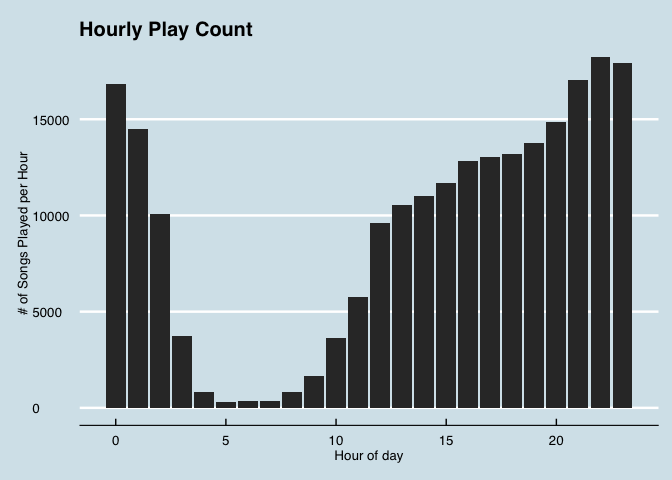
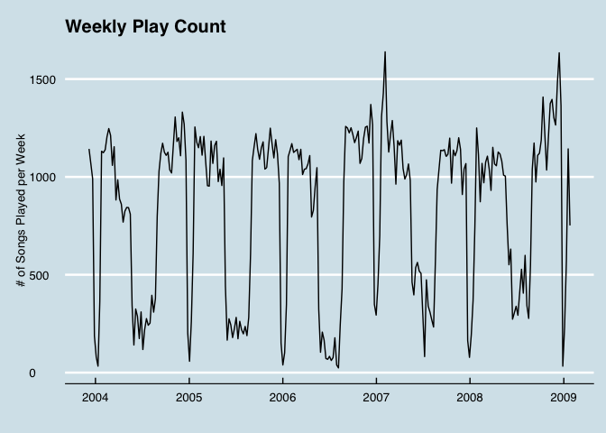
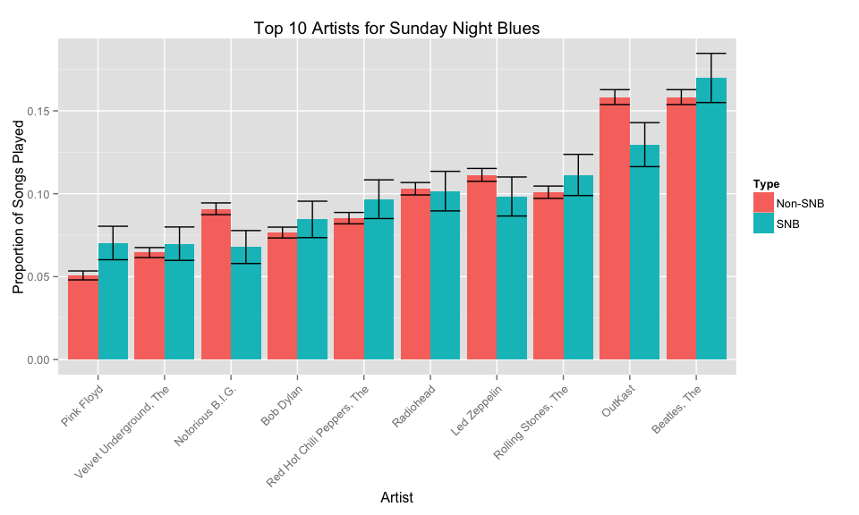

# Code and Data for Reed College Jukebox Analysis
Albert Y. Kim  
April 26, 2015  

This is the code and data used for the [Reed College Jukebox Data](https://github.com/rudeboybert/ReedJukebox) webapp.  The files of importance are

* `jukebox.csv`: comma separated value (CSV) format spreadsheet of songs
* `reed_jukebox_shiny_code.Rmd`: R markdown code to create Shiny app
* `README.Rmd`: R markdown code to generate this page

Click "Download ZIP" on the bottom-right of this page to obtain all necessary files.  

## The Data

We present summaries of all artists played on the Reed College jukebox located in the pool room of the Commons building between November 30th, 2003 and January 22nd, 2009.  The data was generously provided by [Noah Pepper '09](http://www.noahpepper.com/).  The dataset consisted of information on the 222,540 total songs played.  We only present an artist in the drop-down list of artists if they were played a minimum of 50 times during this time period.  The code to generate this webapp can be downloaded from   [GitHub](https://github.com/rudeboybert/ReedJukebox).

## Other Summaries and Visualizations

Hourly play count of songs across the entire time period (Economist theme uncovered by Rennie Meyers):

 

**********

Time series of number of songs played per week:

 

**********

Top ten artists for each academic year (table formatting c/o Emmeline Hill, Jossef Osborn, and Eleanor Parmentier).  Note we define the academic year to be the period in between 

* The first Tuesday in September 
* The last Monday in January plus 15 weeks and 4 days

 Rank  2003-2004                 2004-2005             2005-2006                    2006-2007                    2007-2008                    2008-2009                
-----  ------------------------  --------------------  ---------------------------  ---------------------------  ---------------------------  -------------------------
    1  OutKast                   Led Zeppelin          Beatles, The                 Beatles, The                 Beatles, The                 Beatles, The             
    2  Eminem                    OutKast               Notorious B.I.G.             Notorious B.I.G.             Radiohead                    OutKast                  
    3  Led Zeppelin              Beatles, The          Rolling Stones, The          Red Hot Chili Peppers, The   OutKast                      Radiohead                
    4  Radiohead                 Eminem                OutKast                      Rolling Stones, The          Notorious B.I.G.             Nas                      
    5  Pixies                    Modest Mouse          Led Zeppelin                 OutKast                      Rjd2                         Rolling Stones, The      
    6  Johnny Cash               Rolling Stones, The   2Pac                         Radiohead                    Led Zeppelin                 Notorious B.I.G.         
    7  Modest Mouse              Radiohead             Eminem                       Bob Dylan                    Rolling Stones, The          Talking Heads            
    8  Talking Heads             Pixies                Johnny Cash                  Three 6 Mafia                Red Hot Chili Peppers, The   Rage Against The Machine 
    9  Velvet Underground, The   Lyrics Born           Red Hot Chili Peppers, The   Led Zeppelin                 Velvet Underground, The      Bob Dylan                
   10  Rolling Stones, The       Metallica             Talking Heads                Tenacious D                  Girl Talk                    Clash, The               

**********

A table of the top songs played during the "Sunday Night Blues" period of 4-11pm on Sundays during the academic year:

SNB Artist/Track                                      SNB Count  Non-SNB Artist/Track                                            Non-SNB Count
---------------------------------------------------  ----------  -------------------------------------------------------------  --------------
Roots, The - 08 The Seed (2.0)                               40  Rjd2 - 06 GhostWriter                                                     523
Otis Redding - 10 (Sittin' On) The Dock of the Bay           39  R Kelly - Ignition (Remix)                                                397
Rjd2 - 06 GhostWriter                                        39  Daft Punk - Daft Punk - Harder, Better, Faster, Stronger (1)              356
Lou Reed - Walk on the Wild Side                             33  Jackson 5, The - I Want You Back                                          356
Johnny Cash - 02 Hurt                                        32  Flaming Lips, The - 03 Yoshimi Battles the Pink Robots pt. 1              348
R Kelly - Ignition (Remix)                                   32  Men at Work - Down Under                                                  337
Red Hot Chili Peppers, The - 11 Under the Bridge             32  Lyrics Born - 02.Bad Dreams                                               335
Lyrics Born - 02.Bad Dreams                                  31  Snoop Dogg - Gin and Juice                                                326
Neutral Milk Hotel - 06 Holland, 1945                        31  Queen - Bohemian Rhapsody                                                 322
Rage Against The Machine - 02 Killing in the Name            29  Otis Redding - 10 (Sittin' On) The Dock of the Bay                        321

**********

Limiting consideration to the top 10 artists played during the "Sunday Night Blues" period and song plays during the academic year, we compare the proportion of time these artists were played during the "Sunday Night Blues" period of 4-11pm on Sundays vs 4-11pm on all other days of the week, along with 95% confidence bands (Code c/o Dean Young).  Note that if 

* Two error bars don't overlap, a two-sample test for a difference in means/proportion would yield a statistically significant difference.
* Two error bars do overlap, a two-sample test for a difference in means/proportion **may** still yield a statistically significant difference.

 

## Background and Information

This was an assignment in [Prof. Albert Y. Kim's](http://people.reed.edu/~albkim/) [MATH 241 Case Studies in Statistical Analysis](http://people.reed.edu/~albkim/MATH241/) AKA Data Science class.  Students created all visualizations and conducted all analysis using the open source [R statistical language and environment](http://cran.r-project.org/) via the [RStudio interface](http://www.rstudio.com/).  Students later learned how to make similar interactive webapps to this one via the [Shiny](http://shiny.rstudio.com/) extension to R/RStudio without using any HTML, javascript, CSS, etc, but rather using R and the following packages (extensions to base R):

* [dplyr](http://cran.rstudio.com/web/packages/dplyr/vignettes/introduction.html) package for data manipulation
* [ggplot](http://ggplot2.org/) package for data visualization, which is an implementation of the [*Grammar of Graphics*](http://www.amazon.com/The-Grammar-Graphics-Statistics-Computing/dp/0387245448)
* [lubridate](http://cran.r-project.org/web/packages/lubridate/lubridate.pdf) packages for date/time/time zone processing.

The materials of the class consisted of:

* A [GitHub repository](https://github.com/rudeboybert/MATH241) of all code used and most data sets (some could not be shared for confidentialily reasons) in order to foster notions of [reproducible research](https://www.coursera.org/course/repdata).  
* Periodic slides and homework solutions on [RPubs](http://rpubs.com/rudeboybert).  All items marked "MATH 241" were relevant to this course.
